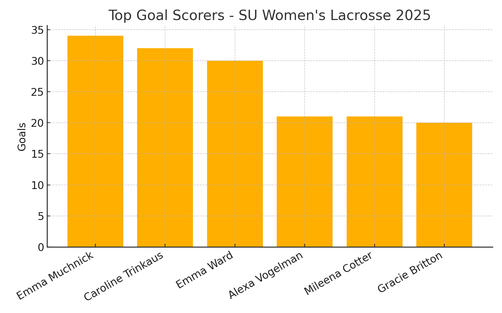
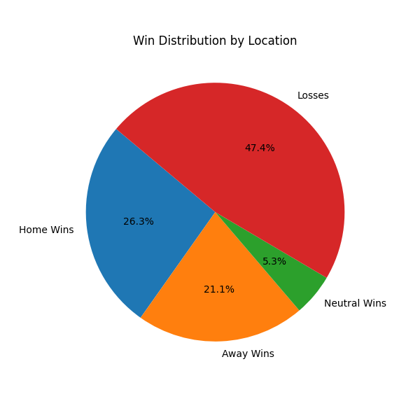

# Task 05: Descriptive Statistics & Large Language Models – Research Report

## Research Topic
This research explores how effectively a Large Language Model (LLM) such as ChatGPT-4 can interpret and analyze structured sports data using natural language prompts. Specifically, this task investigates the 2025 season statistics of Syracuse University's Women’s Lacrosse team, examining how LLMs can be leveraged to automate descriptive statistical insights and even make performance-based judgments typically made by human analysts or coaches.

The broader objective is to understand the strengths and limitations of LLMs when applied to domain-specific data interpretation without custom fine-tuning or deep integrations.

---

## Dataset
- **Source:** 2025 SU Women’s Lacrosse team stats (extracted from official PDF game summaries)
- **Structure:** Game-by-game outcomes, player statistics (goals, assists, turnovers, ground balls), and period-level team stats
- **Scope:** 19 games played; data spans offensive, defensive, and goalie performance

> *Dataset was used in prompt form only and is not uploaded to this GitHub repo.*

---

## Objective
To evaluate how well an LLM:
1. Answers basic descriptive questions (e.g., goals scored, top performers)
2. Handles intermediate stats like shooting percentage or attendance averages
3. Attempts judgment-based insights (e.g., “Who was the most improved player?”)

---

## Tools Used
- **LLM:** ChatGPT-4 (OpenAI)
- **Prompt Medium:** Manual interaction + scripted prompt generation
- **Python Libraries:** pandas, matplotlib
- **Environment:** VS Code & Jupyter for analysis; ChatGPT web UI for interaction

---

## Questions Asked
*See `prompts.txt` for full list.*

- ✅ **Basic**
  - How many games did the team play?
  - What is the overall win-loss record?
  - Which player scored the most goals?

- ⚖️ **Intermediate**
  - What was the shooting percentage?
  - How did Syracuse perform in home vs away games?
  - What was the attendance average?

- 🤖 **Advanced Judgment**
  - Who was the most improved player?
  - Where should the coach focus to win 2 more games: offense or defense?
  - Which single player would have the biggest impact if improved?

---

## Observations & Findings

### ✅ LLM Strengths:
- Correctly identified simple statistics such as win-loss records, goals scored, and top players
- Interpreted natural language prompts with clarity for basic questions
- Performed well when questions were well-scoped and structured

### ⚠️ LLM Limitations:
- Failed or hallucinated when asked abstract questions like “most improved player” without explicit metric definitions
- Required clear explanation of metrics (e.g., what counts as "improvement" or "defensive impact")
- Does not automatically weight context (e.g., quality of opponents or game importance)

---

## Visuals

### 📊 Top Goal Scorers

### 🥧 Win Distribution by Location

### 📈 Game-by-Game Goals (Scored vs Conceded)

---

## How to Reproduce
1. Ask ChatGPT-4 or Claude questions from `prompts.txt`
2. Use `analysis_script.py` to run visualizations
3. (Optional) Plug in your own lacrosse team data in the same format

---
July 31 Update: Initial repo setup with analysis script, prompts, and first visualizations.

Aug 15 Update: Added new charts, expanded prompt tests, implemented validation, and documented LLM limitations. 

## Author
Made by **Esha Alva**  
Syracuse University
